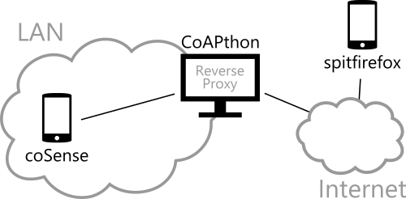

# CoAP Demonstration

[ENSEIRB-MATMECA](http://enseirb-matmeca.bordeaux-inp.fr/en)'s project - RE335 : Advanced subjects - 2017.

*Clément Agil* ([NextStar31](https://github.com/NextStar31)), *Simon Da Silva* ([sdasilvaENSEIRB](https://github.com/sdasilvaENSEIRB)), *Hoang-Thien Nguyen* ([H-TT-N](https://github.com/H-TT-N)), *Rémi Perrot* ([Remi-p](https://github.com/Remi-p))

## Structure

### Sensor

Sensor's role is played by [coSense](https://github.com/okleine/coSense).

### Server

A server example is made with [CoAPthon](https://github.com/Tanganelli/CoAPthon).

### Client

The [spitfirefox](https://github.com/okleine/spitfirefox) CoAP client is used.
