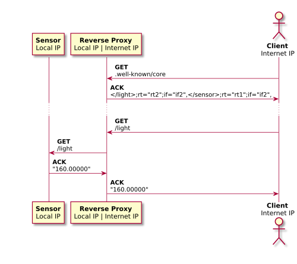

# CoAP Demonstration

[ENSEIRB-MATMECA](http://enseirb-matmeca.bordeaux-inp.fr/en)'s project - RE335 : Advanced subjects - 2017.

*Clément Agil* ([NextStar31](https://github.com/NextStar31)), *Simon Da Silva* ([sdasilvaENSEIRB](https://github.com/sdasilvaENSEIRB)), *Hoang-Thien Nguyen* ([H-TT-N](https://github.com/H-TT-N)), *Rémi Perrot* ([Remi-p](https://github.com/Remi-p))

## Structure

<p align="center"></p>

## Sensor

Sensor's role is played by [coSense](https://github.com/okleine/coSense).

### Usage

Open the project into Android Studio (*File* -> *Open...*), install the APK on your device.

Launch *Coap Thermometer* from your device, activate the server and the sensor.

The ambient light value is accessible through `coap://[ip_addr]/light`.

## Server

A server example is made with [CoAPthon](https://github.com/Tanganelli/CoAPthon).

### Usage

In the `Server/`, directory, issue the following command :
```
$ python coapserver.py -i <ip address> -p <port>
```

Please note, if your default Python installation is the third version, use `python2 coapserver.py ...`.

## Client

The [spitfirefox](https://github.com/okleine/spitfirefox) CoAP client is used.

Any client can be used, like [Copper (Cu)](https://addons.mozilla.org/en-US/firefox/addon/copper-270430/) for Firefox for instance.

## Diagram

<p align="center"></p>
